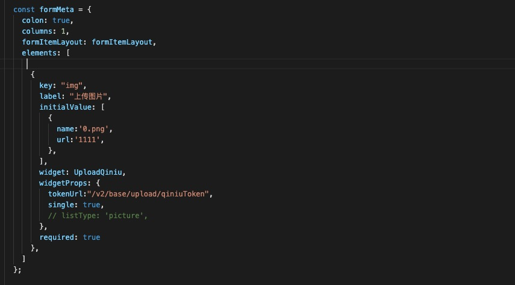

# 表单控件--七牛上传

## form表单里

```
const { UploadQiniu } = Upload;
......
{
  key: "img",
  label: "上传图片",
  initialValue: [
    {
      name:'0.png',
      url:'1111',
    },
  ],
  widget: UploadQiniu,
  widgetProps: {
  tokenUrl:"/v2/base/upload/qiniuToken",
  single: true,
  // listType: 'picture',
  },
  required: true
},
```




#### widgetProps 属性

```
widgetProps: {
    tokenUrl:"/v2/base/upload/qiniuToken", // 后端获取token的地址
    single: true,
    key:  //七牛的key，可填，不填的话自动取file的name作为key
},
```

### 注意点

qiniu.js 这个组件不能跟mock合用，所以得先卸载mock

```
npm uninstall mockjs
```

卸载后需要在mock文件夹里的东西注释掉才能运行起来,如下图mock文件夹里的文件里 的内容注释掉


